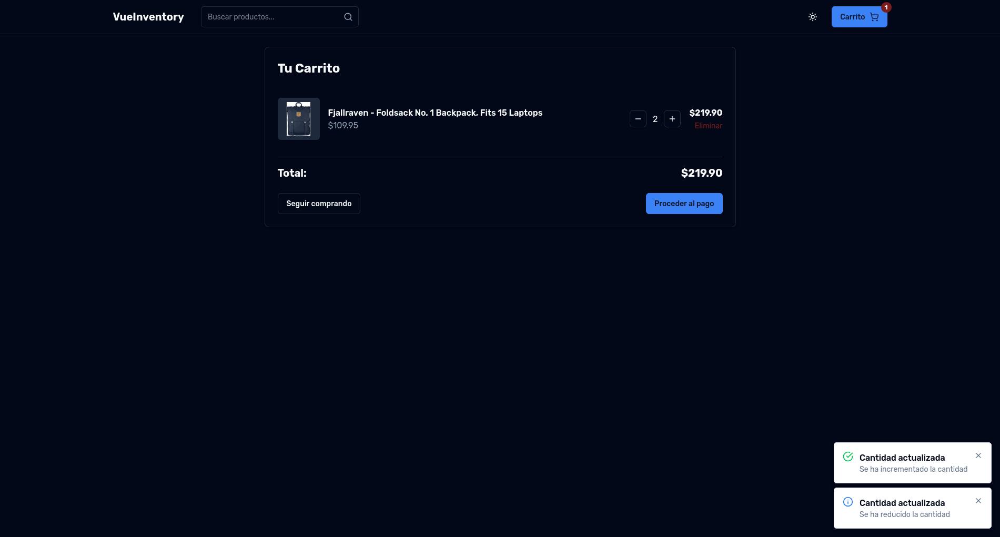

<h1 align="center"> VueInventory </h1>
<div align="center">
  <image src="./resources/Logo.png" align="center" width="300" height="300" />
</div>
<p>
  
  <a href="empty" target="_blank">
    
  </a>
</p>

Para más información sobre el requisitado del proyecto, consulte el archivo [REQUISITADO](docs/requirements/README.md)

Para más información sobre las respuestas a las preguntas del proyecto, consulte el archivo [RESPUESTAS](docs/answers/README.md)

## Descripción

VueInventory es una aplicación web que permite llevar un control de inventario de productos, con la posibilidad de agregar, editar y eliminar productos. La aplicación cuenta con un sistema de autenticación de usuarios, donde se pueden registrar nuevos usuarios y loguearse con una cuenta existente.

## Instalación

El proyecto esta dockerizado, por lo que para correrlo solo es necesario tener instalado Docker y Docker Compose en su máquina. Para correr el proyecto, siga los siguientes pasos:

1. Clone el repositorio en su máquina local
2. Navegue a la carpeta del proyecto
3. Cree un archivo `.env` en la raíz del proyecto con las siguientes variables de entorno:

```sh
PORT=8080
HOST=0.0.0.0
VITE_API_URL=https://fakestoreapi.com
```

4. Ejecute el siguiente comando para construir y correr los contenedores de Docker:

```sh
docker-compose up -d
```

5. Acceda a la aplicación en su navegador en la siguiente dirección:

```sh
http://localhost:8080
```

## Capturas de Pantalla

### Página de Inicio


### Página de Carrito


